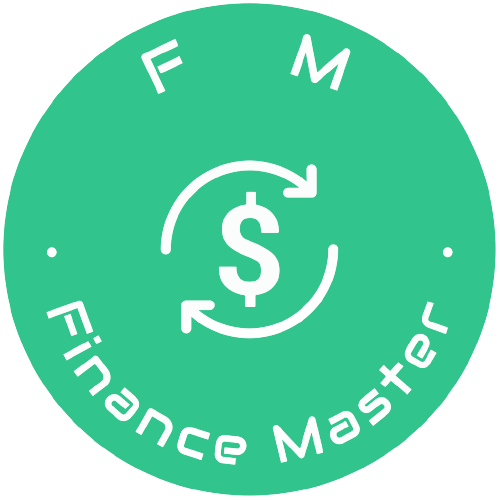
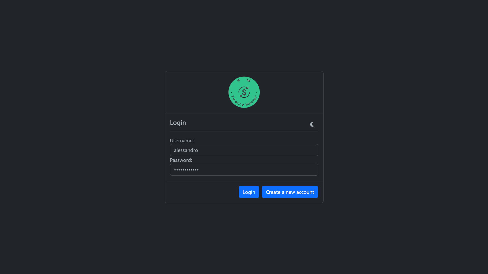
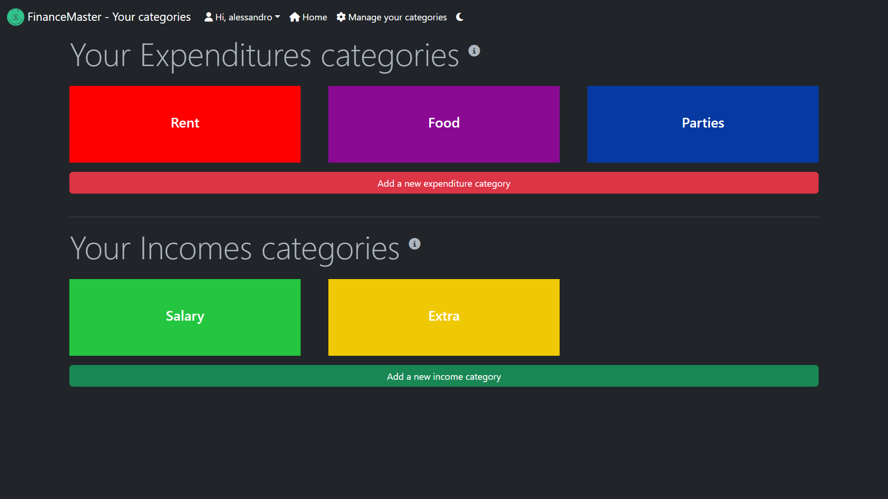
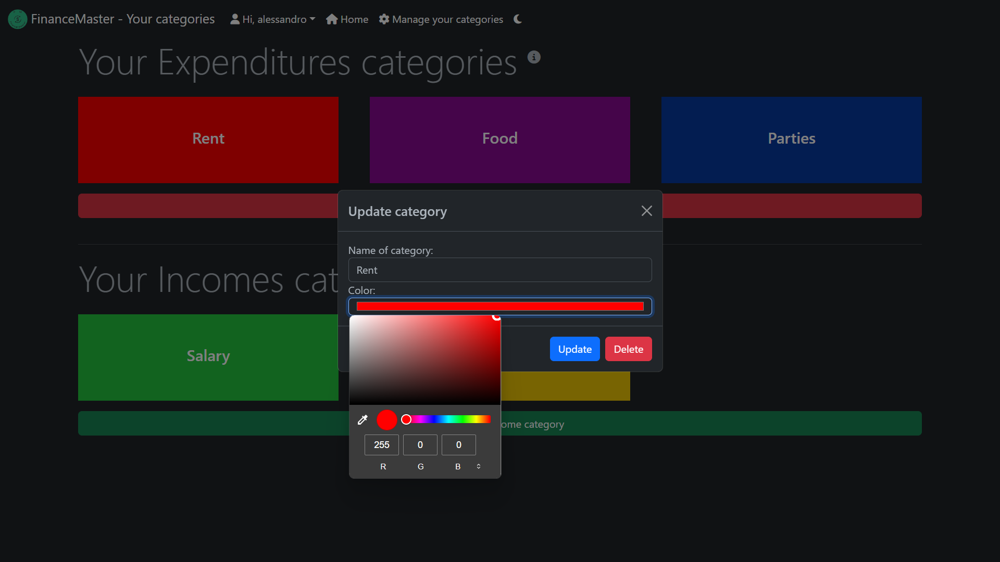
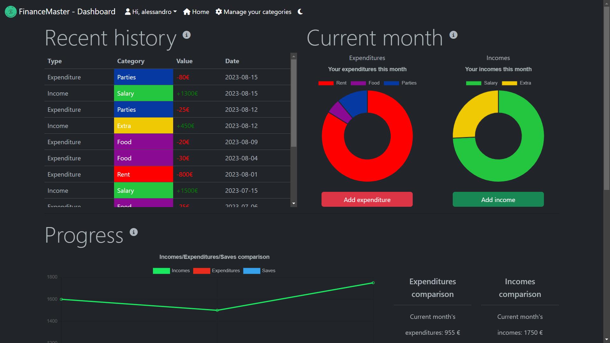
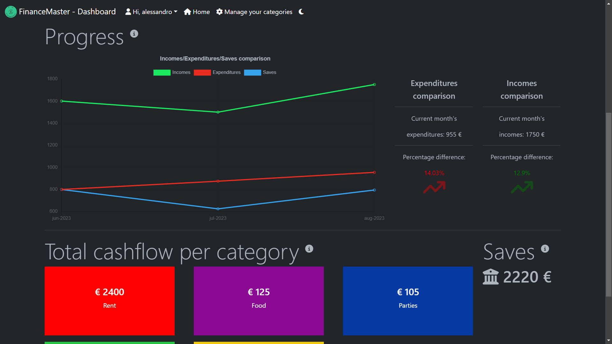
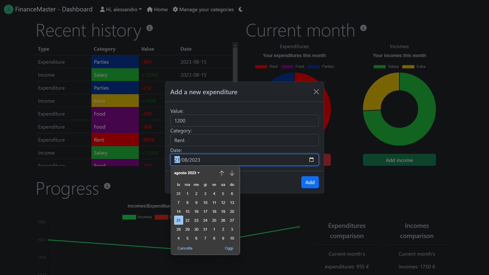
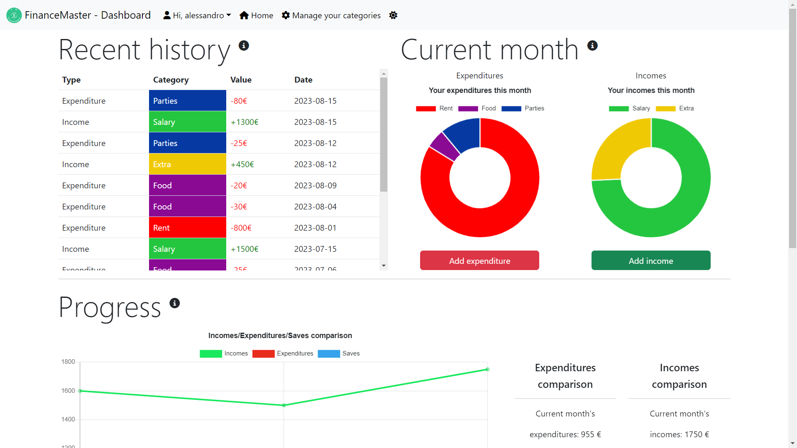
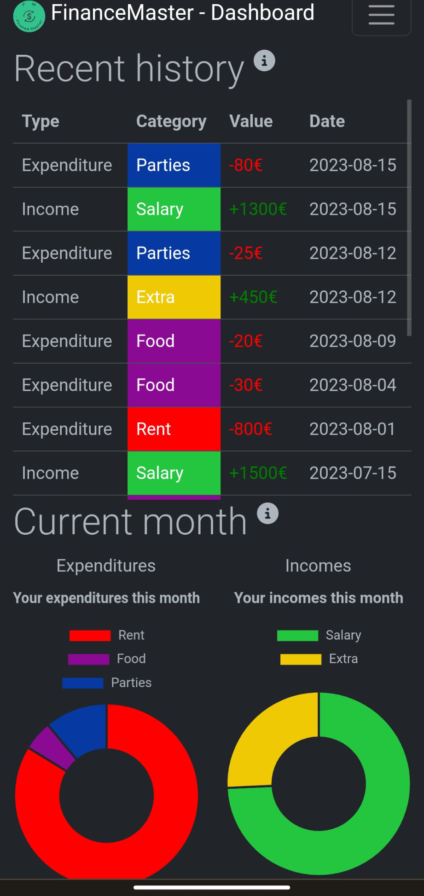

# FinanceMaster

[FinanceMaster](https://financemaster.onrender.com/) is an open-source project whose aim is to track and analyse the incomes and expenditures of the users, providing useful charts and data.

Thanks to this project I managed to learn something about useful technologies such as mongoDB and node.js which I personally never used before.

## Login
The login page allows the users to create a new account or login into an existent one.
Since security was not a top-priority concern for this project, I chose not to implement full server-side handling.

## Categories
From this page, it is possible to add new incomes/expenditures categories or to update the existing ones.
Every category is associated with a color chosen by the user, making it is easier to visualize and interpret different charts.

## Dashboard
The dashboard is the main page of the application. Here you will find various charts and a table displaying all recent transaction, ordered chronologically.

From the dashboard, you can also add an income/expenditure.

## DarkMode
The application supports both light and dark modes and is fully responsive.

## Technologies
- Javascript,
- Nodejs,
- [MongoDB](https://www.mongodb.com/),
- [Chart.js](https://www.chartjs.org/),
- [Bootstrap](https://getbootstrap.com/).
